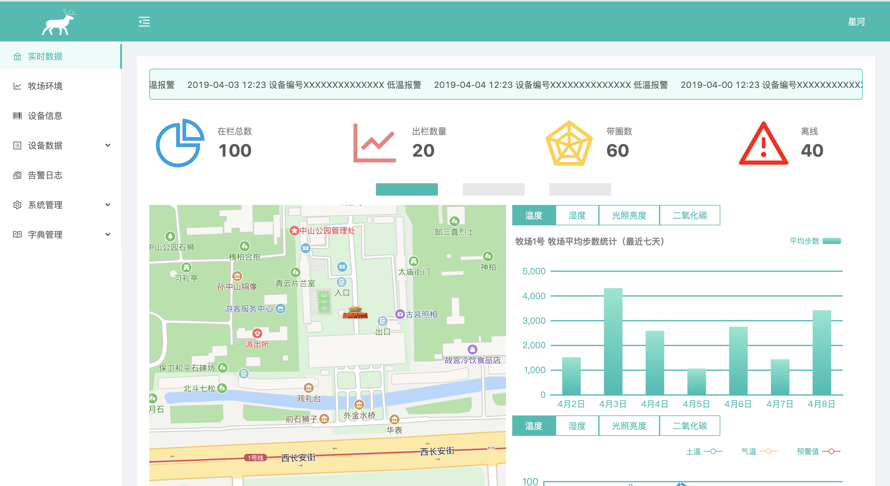
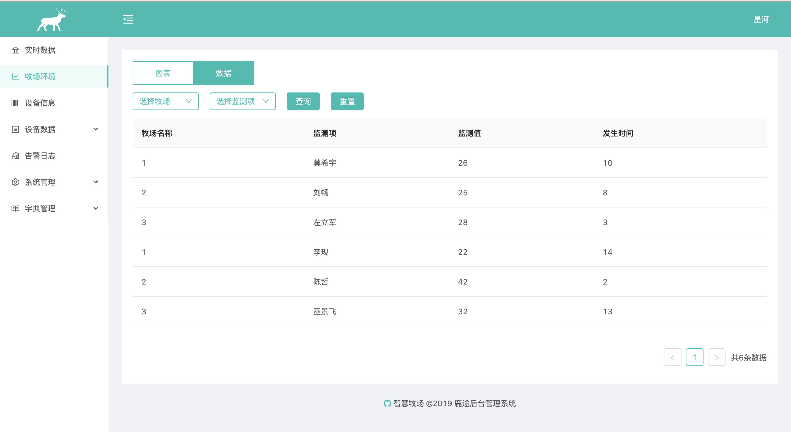

# 鹿途智慧牧场（牛羊定位系统）

## [Live](https://meadow.netlify.com) 



## 项目说明

项目继承[鹿途](https://github.com/ZhouRenYou/ng-deerway)管理系统框架结构,是一个完整的后台管理模版。

## 项目资源

地图：[maps](http://lbsyun.baidu.com/)

图表：[echarts](http://echarts.baidu.com/index.html)

用户认证：[@delon/auth](https://ng-alain.com/auth/getting-started)

项目框架：[ng-zorro](https://ng.ant.design/version/1.8.x/)

## 跨域代理

1、根目录下新增proxy.config.json

```ts
{
  "/apidata": {
    "target": "service address",
    "secure": false,
    "logLevel": "debug",
    "changeOrigin": true,
    "pathRewrite": {
      "^/apidata": ""
    }

  }
}

```
2、angular.json配置文件加载配置代理文件proxyconfig.json
```ts
"serve": {
  "builder": "@angular-devkit/build-angular:dev-server",
  "options": {
    "browserTarget": "project1:build",
      "proxyConfig": "proxy.config.json"
  },

```
3、component使用

```ts
login(params: { userCode: any; password: any; }): Observable<any> {
    return this.http.post('apidata/account/login', params);
  }
```
4、重启运行
```ts
ng serve --proxy-config proxy.config.json
```

## 提示

项目打包后刷新路由丢失,在app.module.ts中新增如下

```ts
providers:[
{ provide: LocationStrategy, useClass: HashLocationStrategy }
]
```

## 非重要说明

如果满意这个模版，请给我个小星星😊